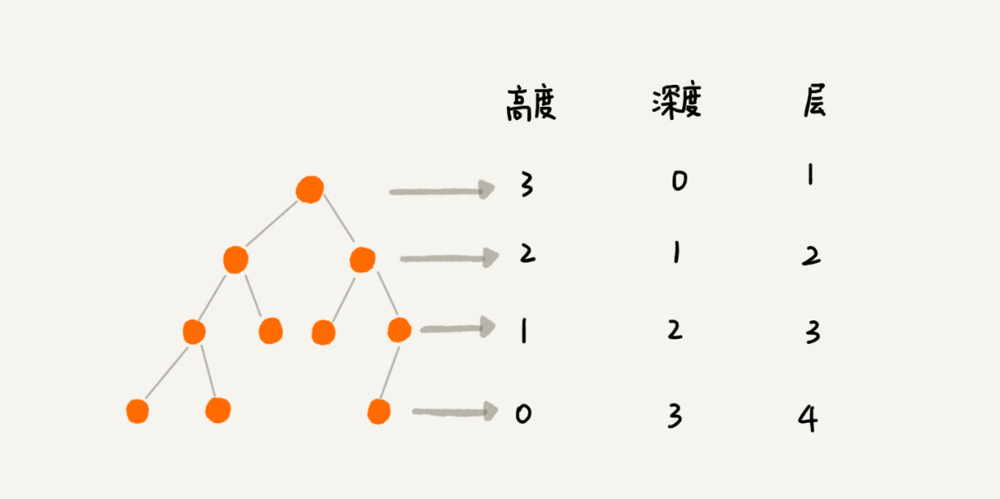
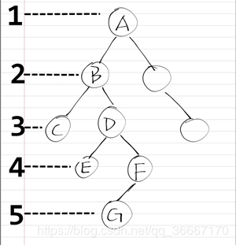
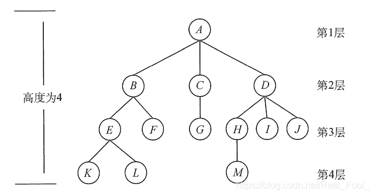
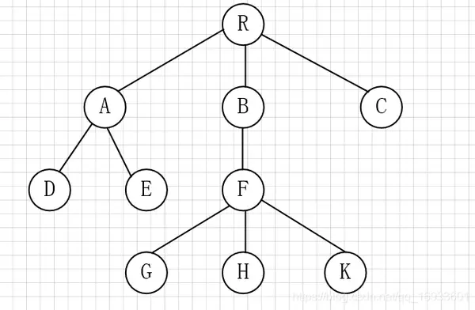
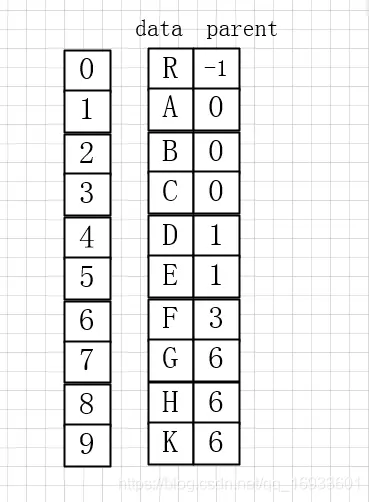
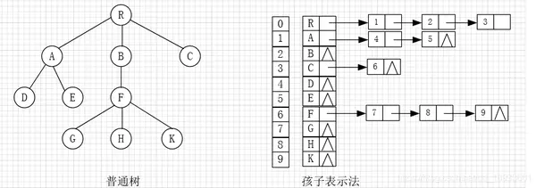
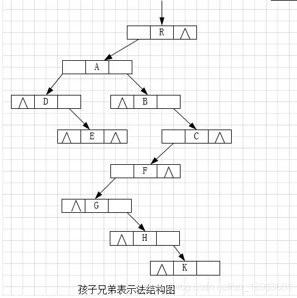

# 树
## 树的基本概念
### 树的定义
树是n（n>=0）个结点的有限集。当n = 0时，称为空树。在任意一棵非空树中应满足：
1. 有且仅有一个特定的称为根的结点。
2. 当n>1时，其余节点可分为m（m>0）个互不相交的有限集T1,T2,…,Tm，其中每个集合本身又是一棵树，并且称为根的子树。

显然，树的定义是递归的，即在树的定义中又用到了自身，树是一种递归的数据结构。树作为一种逻辑结构，同时也是一种分层结构，具有以下两个特点：
1. 树的根结点没有前驱，除根结点外的所有结点有且只有一个前驱。
2. 树中所有结点可以有零个或多个后继。

因此n个结点的树中有n-1条边。

### 基本术语
下面结合图示来说明一下树的一些基本术语和概念。

#### 高度、深度、层次
深度是从上往下数的，高度是从下往上数的，深度和高度都涉及到节点的层数(经过学习发现，深度、高度概念在不同的教材中有不同的定义，主要看高度深度的初值为几，有的为0，有的为1)。

1. 高度（Height）
   1. 节点的高度：对于树中的任意节点，它的高度是指从该节点到其最远叶子节点的最长简单路径上边的数目。换句话说，它是从该节点开始，沿着向下方向到最底部叶子节点的边的数量。根节点的高度等于整棵树的高度。
   2. 树的高度：指的是整棵树中所有节点高度中的最大值，也就是从根节点到最远叶子节点的边数。
   3. 一般情况下，树的高度从1开始计算。

2. 深度（Depth）
   1. 节点的深度：指从根节点到该节点的路径上边的数目。根节点的深度定义为0，其它每个节点的深度是其父节点的深度加1。
   2. 树的深度：有时也被称为树的高度，是指树中深度最大的节点的深度，即从根节点到离根最远节点的边数。
   3. 有两者方式，根节点深度为0，根节点深度为1

3. 层次（Level）
   1. 节点的层数：树中的每一层是一组具有相同深度的节点。根节点单独构成第0层，根的直接子节点构成第1层，依此类推。节点的层数即是它在树中的深度加1。
   2. 第k层的节点：所有深度为k-1的节点构成的集合。

4. 定义一（初值为0）：
   1. 节点的深度是根节点到这个节点所经历的边的个数
   2. 节点的高度是该节点到叶子节点的最长路径（边数）
   3. 树的高度等于根节点的高度

5. 定义二(初值为1)：
   1. 节点的深度是根节点到这个节点的最长路径上的节点数
   2. 节点的高度是该节点到最远叶子节点的最长路径上的节点数

最小深度:从根节点到最近叶子节点的最短路径上的节点数量(初值为1)。

#### 节点关系

考虑结点K。根A到结点K的唯一路径上的任意结点,称为结点K的祖先。如结点B是结点K的祖先,而结点K是结点B的子孙。路径上最接近结点K的结点E称为K的双亲,而K为结点E的孩子。根A是树中唯一没有双亲的结点。有相同双亲的结点称为兄弟,如结点K和结点L有相同的双亲E,即K和L为兄弟。

#### 度
树中一个结点的孩子个数称为该结点的度,树中结点的最大度数称为树的度。

#### 分支结点和叶子节点
度大于0的结点称为分支结点(又称非终端结点);度为0(没有子女结点)的结点称为叶子结点(又称终端结点)。在分支结点中,每个结点的分支数就是该结点的度。

#### 有序树和无序树
树中结点的各子树从左到右是有次序的,不能互换,称该树为有序树,否则称为无序树。假设图为有序树,若将子结点位置互换,则变成一棵不同的树。

#### 路径和路径长度
树中两个结点之间的路径是由这两个结点之间所经过的结点序列构成的,而路径长度是路径上所经过的边的个数。

注意:由于树中的分支是有向的,即从双亲指向孩子,所以树中的路径是从上向下的,同一双亲的两个孩子之间不存在路径。

#### 森林
森林是m (m≥0)棵互不相交的树的集合。森林的概念与树的概念十分相近，因为只要把树的根结点删去就成了森林。反之，只要给m棵独立的树加上一个结点，并把这m棵树作为该结点的子树，则森林就变成了树。

### 树的性质
树具有如下最基本的性质：

1. 树中的结点数等于所有结点的度数加1.
2. 度为 m 的树中第 i 层上至多有m^{i-1} 个结点(i>=1)
3. 高度为 h 的 m叉树至多有(m^h −1)/(m−1)个结点
4. 具有 n 个结点的 m叉树的最小高度为[log(m, (n(m−1)+1))]。

## 树的存储结构
在介绍以下三种存储结构的过程中，我们都以下面这个树为例子。

### 双亲表示法

1. 特点：
- 存储结构：使用一维数组来存储树中所有节点的信息。数组中的每个元素对应一个节点，除了存储节点本身的值或数据外，还包含一个额外的字段用于存储该节点父节点在数组中的索引位置。

- 根节点处理：由于根节点没有父节点，通常会约定将根节点的父节点位置标记为一个特殊值，如-1或者数组的第一个有效位置（如果根节点在数组的第一个位置）。

- 优点：双亲表示法简化了寻找任何节点的直接父节点的操作，只需常数时间O(1)即可完成。这对于需要频繁查询节点父节点的应用场景非常高效。

- 缺点：虽然访问父节点变得容易，但是查找子节点、兄弟节点或确定节点的层次等操作则相对复杂，可能需要遍历整个数组来完成，效率较低。

2. 实现要点：
- 初始化：创建一个足够大的数组来容纳树中所有节点，同时为每个节点分配一个字段用于存放其父节点的数组索引。

- 插入节点：在插入新节点时，除了在数组中为其分配空间并存储数据外，还需要更新该节点父节点在数组中的记录，将其指向新节点的位置。

- 查询操作：如需查询某个节点的父节点，直接通过该节点记录的父节点索引访问数组即可；而对于其他如子节点、兄弟节点的查询，则需要通过循环或递归遍历数组来实现。

- 遍历：尽管双亲表示法不直接支持快速的子节点遍历，但可以基于此结构通过多次查询父节点的方式来间接实现树的遍历，例如从叶节点向上遍历到根节点。

3. 参考代码
[树的双亲表示法](code/树的双亲表示法.cpp)

### 孩子表示法

树的孩子表示法（Child Representation），又称为孩子链表表示法，是一种用来存储树形结构的高效方法，尤其适用于那些需要频繁访问节点的孩子节点的场景。这种表示法利用了顺序表和链表的组合来表示树结构，具体实现如下：

1. 基本思想：
- 顺序表：首先，使用一个数组（顺序表）来存储树中所有节点的数据或值。数组的每个元素代表一个节点，数组的索引可以看作是节点的一个唯一标识。

- 链表：对于每个节点，其直接的孩子节点不是存储在顺序表的相邻位置，而是通过链表的形式链接起来。每个节点包含一个指针（或引用）指向其第一个孩子节点，然后这个孩子节点又包含指针指向下一个兄弟节点，以此类推，直到最后一个孩子节点的指针为空，表示孩子链结束。

2. 特点：
    1. 高效访问孩子节点：通过每个节点直接保存对其孩子节点的引用，可以迅速访问到一个节点的所有直接子节点。
    2. 节省空间：相比于双亲表示法，孩子表示法不需要为每个节点存储父节点的引用，这在节点数量庞大时可以节省空间。
    3. 复杂性：虽然访问孩子节点很快，但要找到一个节点的父节点、祖先节点或兄弟节点则相对困难，可能需要遍历或额外的辅助结构。
    4. 便于构造和修改树：添加或删除孩子节点操作较为直观，仅需修改相关节点的指针即可，无需调整整个数据结构。

3. 实现细节：
- 数据结构：每个节点的数据结构通常包含两部分：节点的值（或数据）以及指向其第一个孩子节点的指针。

- 遍历：实现遍历操作（如前序、中序、后序遍历）时，通常需要采用栈或递归，因为直接的顺序访问不再自然反映树的层次关系。

- 应用：孩子表示法特别适合于那些关注节点的后代关系多于祖先关系的算法或问题中，如某些类型的图遍历算法、表达式树的处理等。

4. 参考代码
[树的孩子表示法](code/树的孩子表示法.cpp)

### 孩子兄弟表示法
树的孩子兄弟表示法（Child-Sibling Representation），也称为左孩子右兄弟表示法，是一种将树结构转换为二叉链表形式的存储方法，以便利用二叉树的算法和性质来操作树。这种方法通过改变节点的链接方式，使得每个节点都有两个链接：一个指向其第一个孩子，另一个指向其下一个兄弟节点。下面是孩子兄弟表示法的详细介绍：

1. 基本概念：
    - 左指针：每个节点都有一个左指针，这个指针指向该节点的第一个孩子。如果没有孩子，则该指针为NULL。
    - 右指针：每个节点还有一个右指针，它指向该节点的下一个兄弟节点。如果该节点是其父节点的最后一个孩子，则右指针指向NULL。

2. 特点：
    1. 二叉化表示：通过这种方式，任何树都可以被转换成一个等价的二叉树结构，使得对树的操作可以借助于二叉树的算法来实现。
    2. 遍历操作：支持类似于二叉树的遍历，如先序遍历（访问节点，再遍历左子树，最后遍历右子树，这里的“左子树”是第一个孩子，“右子树”是兄弟链表）和后序遍历。
    3. 操作简便：对于求树的高度、叶子节点数、总结点数等操作，可以直接借鉴二叉树的相关算法。
    4. 空间效率：相比其他表示法，孩子兄弟表示法并不减少存储需求，但它通过统一表示提高了算法的通用性和复用性。

3. 实现要点：
   - 结构定义：每个节点的数据结构至少包含三个部分：节点值、指向第一个孩子的指针（左指针）、指向下一个兄弟的指针（右指针）。
    - 转换过程：将原始树转换为孩子兄弟表示法时，需要重新组织节点之间的连接关系，确保每个节点的左指针指向第一个孩子，右指针指向下一个兄弟。
    - 遍历和操作：利用二叉树的遍历算法，对转换后的结构进行遍历，访问顺序会有所不同，但逻辑相似。例如，先序遍历会先访问当前节点，然后遍历左子树（第一个孩子），再遍历“右子树”（兄弟链表）。

4. 应用场景：
孩子兄弟表示法特别适用于需要频繁执行树的遍历和修改操作的场景，尤其是在算法设计和实现中，可以利用二叉树成熟的算法基础，简化树的操作逻辑和代码实现。

5. 参考代码
[树的孩子兄弟表示法](code/树的孩子兄弟表示法.cpp)

## 树的分类
### 1 按子节点数量限制分类：
- 二叉树(binary tree)：每个节点最多有两个子节点，分别为左子节点和右子节点。
    - 完美二叉树(Perfect Binary Tree)：又称理想二叉树，除了叶子结点之外的每一个结点都有两个孩子，每一层都被完全填充
    - 完全二叉树(Complete Binary Tree)：除了最后一层之外的其他每一层都被完全填充，并且所有结点都保持向左对齐。
    - 满二叉树(Full Binary Tree)：所有层级都有最大节点数，每个层级的节点数是上一层的两倍。
    - 线索二叉树：将空指针指向某种顺序遍历下的前驱或后继节点，以加快遍历速度。
- 多叉树(multi-way tree)：每个节点可以有超过两个子节点。如B树、字典树（Trie）等。

### 2 按节点值的有序性分类：
- 有序树：树中节点的子节点有固定顺序，如二叉查找树。
- 无序树：节点间的值没有特定的顺序关系。

### 3 按特定用途或性质分类：
- 二叉查找树：又称排序二叉树、二叉搜索树、二叉排序树等，是数据域有序的二叉树，即对树上的每个结点，都满足其左子树上所有结点的数据域均小于或等于根结点的数据域，右子树上所有结点的数据域均大于根结点的数据域。
    - 平衡二叉树(AVL树)：保证其左子树与右子树的高度之差的绝对值不超过1，其中左子树与右子树的高度因子之差称为平衡因子。是最先发明的自平衡二叉查找树之一，适用于频繁查找操作。
    - 红黑树：通过节点颜色（红或黑）来维持平衡，不是严格的平衡，但插入和删除操作更高效，广泛应用于关联容器如STL的map和set。

- 多路查找树
    - B树(B-Tree)：用于外部存储（如硬盘）的自平衡查找树，每个节点可以有多个子节点，适用于大量数据存储和快速查找。
    - B+树(B+Tree)：B树的一种变体，所有数据都存储在叶子节点，叶子节点间有指针相连，数据库索引中常用的平衡多路搜索树，适合磁盘存储，用于提高大规模数据检索效率。
    - B*树：B+树的进一步优化，非叶子节点也有指向兄弟节点的指针，提高了查找效率。

- 字典树（Trie）
    - Trie树：又称前缀树，用于高效存储和查找字符串集合，每个节点代表一个字符串的前缀。

- 特殊用途树
    - 堆：一种特殊的完全二叉树，常用于实现优先队列，如二叉堆、斐波那契堆。
    - 2-3树：一种自平衡查找树，每个节点最多有两个键，可能有两个或三个子节点，是B树的前身。
    - 2-3-4树：2-3树的扩展，节点最多四个子节点，每个节点最多三个键，是B树的另一种解释形式。
    - 树堆(Treat)：一种完全二叉树，常用于实现优先队列，包括最大堆和最小堆。
    - 伸展树（Splay Tree）：每次访问后都会将节点旋转到根部，使得经常访问的节点更容易再次访问。
    - 胜者树（Winner Tree）：用于快速找出一系列元素中的最大值或最小值，常用于锦标赛排序。
    - 败者树（Loser Tree）：与胜者树相似，用于记录败者路径，同样用于排序和选择问题。
    - 堆栈树（Stack Tree）：一种特殊的树形数据结构，用于实现高效的功能性编程中的堆栈操作。
    - 线段树（Segment Tree）：用于区间查询和更新的高效数据结构，如区间最值、区间求和等。
    - 跳跃搜索树（Skip List）：一种随机化的数据结构，类似于有序链表，但通过多级索引来提高查找效率。

## 树的应用
### 哈夫曼树和哈夫曼编码
哈夫曼树（Huffman Tree）和哈夫曼编码（Huffman Coding）是数据压缩领域的两个重要概念，它们是由David A. Huffman在1952年提出的，主要用于无损数据压缩。

